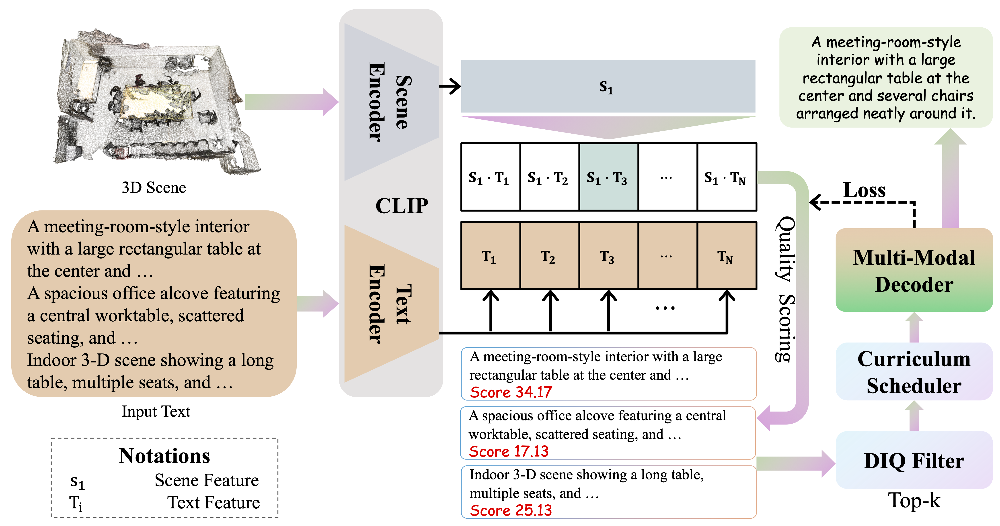

#  DC-Scene: Data-Centric Learning for 3D Scene Understanding

Code implementation for the paper:

> **DC-Scene: Data-Centric Learning for 3D Scene Understanding**
>
> [Ting Huang](https://believeht029.github.io/)\*, [Zeyu Zhang](https://steve-zeyu-zhang.github.io/)\*†, [Ruicheng Zhang](https://github.com/SYSUzrc), and [Yang Zhao](https://scholar.google.com.au/citations?user=UrVEK7IAAAAJ&hl=en&oi=sra)‡
>
> \*Equal contribution. †Project lead. ‡Corresponding author.
>
> ***PRL 2026 & 3DV 2026 Exploration Edge Track***
>
> ### [Paper](https://arxiv.org/abs/2505.15232)

---

## Citation

```bibtex
@article{huang2025dc,
  title={DC-Scene: Data-Centric Learning for 3D Scene Understanding},
  author={Huang, Ting and Zhang, Zeyu and Zhang, Ruicheng and Zhao, Yang},
  journal={arXiv preprint arXiv:2505.15232},
  year={2025}
}
```

---

## 🏃 Introduction

DC-Scene improves the data efficiency of 3D dense captioning by selecting semantically reliable, informative scene–caption pairs and organizing them into a progressive curriculum. The data-centric layer supports **3D CoCa** and **Vote2Cap-DETR++** on **ScanRefer** and **Nr3D**.



The framework follows a quality-scoring–selection–curriculum pipeline:

- **Quality scoring:** a pretrained captioning model supplies summed token negative log-likelihood, while aligned scene/text embeddings supply semantic similarity.
- **Dual-Indicator Quality (DIQ):** the intersection of the 5th–95th percentile intervals removes extreme alignment and caption-loss outliers.
- **Progressive training:** three 360-epoch stages process 25%, 50%, and 75% of the original training pairs.
- **Feedback:** optional stage-boundary rescoring updates the quality map from the current captioner.

The experimental schedule processes approximately **50% of the full-data sample budget**. The supplied manuscript reports **13.4 versus 24.6 GPU hours**, a **45.5% reduction**, under the same 1,080-epoch schedule. These are paper results, not measurements from this implementation.

The manuscript leaves the scalar DIQ ranking and feedback frequency unspecified, and its increasing-threshold equations conflict with its expanding experimental schedule. This implementation makes these choices explicit in [method notes](docs/method.md). The default alignment scorer uses pretrained CoCa joint latents; exact external CLIP-aligned embeddings can also be imported.

## 📦 Data Preparation

Prepare licensed ScanNet scans and official ScanRefer/Nr3D annotations following [docs/data.md](docs/data.md). Metadata and upstream vocabularies are included; scans, language annotations, and model weights are not.

```text
data/
├── ScanRefer_filtered_{train,val}.{json,txt}
├── ScanRefer_vocabulary.json
├── nr3d_{train,val}.{json,txt}
├── nr3d_vocabulary.json
└── scannet/
    ├── meta_data/
    └── scannet_data/
        ├── scene0000_00_aligned_vert.npy
        ├── scene0000_00_aligned_bbox.npy
        ├── scene0000_00_ins_label.npy
        └── scene0000_00_sem_label.npy
```

Generate scene lists or convert Nr3D annotations:

```bash
python scripts/prepare_annotations.py --dataset scanrefer --data_root data
python scripts/prepare_annotations.py --dataset nr3d --data_root data
```

Set `data_root`, `scan_root`, and `metadata_root` in the configuration. Selection is performed at the **annotation-pair level**; each sample exposes only its chosen caption to the loss. Validation uses complete scenes and is never filtered.

## ⚙️ Environment Setup

Use **Linux, Python 3.10+, an NVIDIA CUDA GPU**, and a CUDA-enabled PyTorch installation. Install PyTorch/torchvision for your CUDA toolchain first, then:

```bash
python -m pip install -r requirements.txt
bash scripts/build_extensions.sh
```

3D CoCa additionally requires [MinkowskiEngine](https://github.com/NVIDIA/MinkowskiEngine), compiled against the same PyTorch/CUDA environment. Its frozen visual transformer loads OpenAI CLIP `ViT-B/32`; cache those weights before offline runs. Vote2Cap-DETR++ training/inference does not require MinkowskiEngine unless CoCa is used to compute or refresh quality scores.

Caption evaluation requires Java for the bundled upstream METEOR scorer.
### Pretrained Checkpoints

DC-Scene requires pretrained captioners for meaningful quality estimation. Use compatible weights for the selected dataset, vocabulary, backbone, and input channels. `--checkpoint` and `--resume` load strictly; incompatible weights fail explicitly.

For upstream checkpoint migration, `--init ... --allow_partial_init` loads only matching tensors and reports omissions. CoCa integration fixes require additional trained parameters, so partial initialization must be followed by full-data training before the checkpoint is used for scoring.

A full-data training/bootstrap command is provided below. The resulting DC-Scene checkpoint can then be scored and used to initialize curriculum training. No DC-Scene pretrained checkpoint is bundled.

## 🚀 Training

### Stage 0: Prepare a Pretrained Backbone

Skip this when you already have a compatible pretrained checkpoint.

```bash
python main.py --config configs/3dcoca_scanrefer.json \
  --strategy full --checkpoint_dir outputs/coca_full
```

Optionally add `--init checkpoints/upstream.pth --allow_partial_init` to warm-start. This stage uses all training pairs for 1,080 epochs. Pretraining and quality-scoring costs are separate from the curriculum's sample budget.

### Stage 1: Score Training Pairs

```bash
bash scripts/score.sh configs/3dcoca_scanrefer.json \
  outputs/coca_full/checkpoint_last.pth \
  outputs/quality/3dcoca_scanrefer.json
```

The scorer disables augmentation and dropout, fixes per-pair point subsampling, and writes a JSON table with annotation fingerprints and checkpoint provenance. Caption difficulty is **summed NLL, including EOS and excluding padding**, as in equation (3).

For Vote2Cap-DETR++, use its pretrained captioner for NLL and a compatible pretrained CoCa model for semantic alignment:

```bash
bash scripts/score.sh configs/vote2cap_detrpp_scanrefer.json \
  checkpoints/vote2cap_scanrefer.pth \
  outputs/quality/vote2cap_detrpp_scanrefer.json \
  --alignment_checkpoint outputs/coca_full/checkpoint_last.pth
```

Alternatively, [import precomputed aligned embeddings and NLL](docs/data.md#external-quality-features).

### Stage 2: Train the DIQ Curriculum

```bash
bash scripts/train.sh configs/3dcoca_scanrefer.json \
  --init outputs/coca_full/checkpoint_last.pth
```

| Stage | Epochs (1-based) | Fraction of original training pairs |
|---|---:|---:|
| Initialization | 1–360 | 25% |
| Intermediate | 361–720 | 50% |
| Advanced | 721–1,080 | 75% |

Defaults: AdamW, batch size **8**, initial learning rate **1e-4**, cosine decay, and one GPU. Checkpoints preserve model/optimizer states, completed epoch, RNG states, processed-pair counts, and curriculum identity. Resume an interrupted run with:

```bash
bash scripts/train.sh configs/3dcoca_scanrefer.json \
  --resume outputs/3dcoca_scanrefer/checkpoint_last.pth
```

Add `--refresh_at_stages` to recompute DIQ at epochs 361 and 721. For Vote2Cap, also supply `--alignment_checkpoint`. This optional feedback policy costs two extra full scoring passes; the default uses a fixed cached quality map.

Configurations are available for all four backbone/dataset combinations in [configs/](configs/). Nr3D presets use IoU **0.50**; ScanRefer presets use **0.25**. For static DIQ-75% use `--ratios 0.75 --stage_epochs 1080`; for ablations use `--strategy full`, `random`, `clip`, or `loss`. See [method notes](docs/method.md) for selection semantics.

## 🤖 Inference

Generate object boxes and captions from a ScanNet-style aligned point cloud, without caption annotations:

```bash
python main.py --config configs/3dcoca_scanrefer.json --mode predict \
  --checkpoint outputs/3dcoca_scanrefer/checkpoint_last.pth \
  --point_cloud data/scannet/scannet_data/scene0000_00_aligned_vert.npy \
  --output outputs/scene0000_00_predictions.json
```

The input is an `N×9` NumPy array containing XYZ, RGB in `[0,255]`, and normals for the default preset. Prediction needs the matching vocabulary and class metadata. Output JSON contains NMS-filtered proposals, captions, semantic classes, confidence, centers, sizes, and box corners. CoCa uses autoregressive greedy decoding; Vote2Cap additionally supports `--use_beam_search`.

## 📊 Evaluation

```bash
bash scripts/evaluate.sh configs/3dcoca_scanrefer.json \
  outputs/3dcoca_scanrefer/checkpoint_best.pth
```

Evaluation preserves the upstream IoU matching and NMS protocol and reports CIDEr, BLEU-4, METEOR, and ROUGE-L. Outputs include `metrics.json`, `pred_val.json`, and `pred_gt_val.json`. Use `checkpoint_last.pth` if training validation was disabled with `--eval_every_epochs 0`.

**Results reported in the supplied manuscript** (without additional 2D input):

| Dataset | Backbone | Data | CIDEr ↑ | BLEU-4 ↑ | METEOR ↑ | ROUGE-L ↑ |
|---|---|---|---:|---:|---:|---:|
| ScanRefer @0.25 | Vote2Cap-DETR++ | Full | 76.36 | 41.37 | 28.70 | 60.00 |
| ScanRefer @0.25 | Vote2Cap-DETR++ | DC-Scene 75% | 78.55 | 41.20 | 29.10 | 60.95 |
| ScanRefer @0.25 | 3D CoCa | Full | 85.42 | 45.56 | 30.95 | 61.98 |
| ScanRefer @0.25 | 3D CoCa | DC-Scene 75% | **86.10** | **46.00** | **31.40** | **62.20** |
| Nr3D @0.50 | Vote2Cap-DETR++ | Full | 47.08 | 27.70 | 25.44 | 55.22 |
| Nr3D @0.50 | Vote2Cap-DETR++ | DC-Scene 75% | 48.10 | 28.20 | 25.70 | 55.60 |
| Nr3D @0.50 | 3D CoCa | Full | 52.84 | 29.29 | 25.55 | 56.43 |
| Nr3D @0.50 | 3D CoCa | DC-Scene 75% | **53.60** | **29.40** | **26.00** | **56.50** |

The paper reports three-run CIDEr standard deviations of ±0.23 (ScanRefer) and ±0.21 (Nr3D) for DC-Scene with 3D CoCa. These results have **not been reproduced with this code**. Metric JSON retains upstream raw scales; the paper table displays scores multiplied by 100.

## 😘 Acknowledgement

We thank the authors of [3D CoCa](https://github.com/AIGeeksGroup/3DCoCa), [Vote2Cap-DETR](https://github.com/ch3cook-fdu/Vote2Cap-DETR), [3DETR](https://github.com/facebookresearch/3detr), [Scan2Cap](https://github.com/daveredrum/Scan2Cap), and [VoteNet](https://github.com/facebookresearch/votenet) for their research and open-source implementations.
